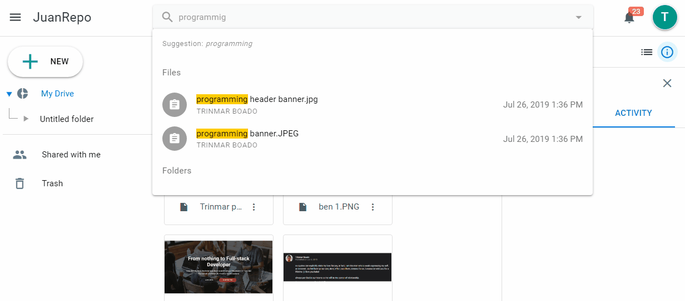

[](https://badge.fury.io/js/puzzy-search)

# feathers-nedb-puzzy-search
Add google-like `search` and `auto suggest` (did you mean...)

 - [x] misspelled words
 - [x] fuzzy search
 - [x] suggest similar words

<p align="center">
  
</p>

> **Join and support our Community** <br />
> Web and Mobile Developers PH <br />
> [ [Facebook Page](https://fb.com/webmobile.ph) | [Group](https://fb.com/groups/webmobile.ph/) ]

## Install
```
npm install puzzy-search
```

## Usage
```js
const { search, suggest } = require('puzzy-search')

const sentence = 'You want the web server to support four of the most popular programming paradigms.'

const str = 'puppular programmng paradim'

search(str, sentence) // true
suggest(str, sentence) // popular programming paradigm
```


# *Join and support our Community* <br /> **Web and Mobile Developers PH** <br/> [ [Facebook Page](https://fb.com/webmobile.ph) | [Group](https://fb.com/groups/webmobile.ph/) ]

## License
ISC © 2019 Trinmar Boado
MIT © 2019 Ray Foss
MIT © 2017 Arve Seljebu
